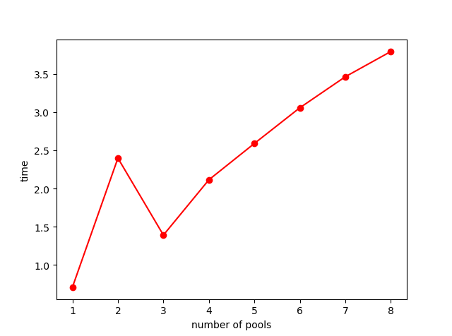

\mainmatter

# 分布式计算：背景与挑战{#introduction}

在大数据时代，全球数字数据每两年增加一倍。海量的数据给了数据科学家们更广阔的应用空间。利用
丰富的数据分析工具，从数据中挖掘出有价值的信息，让决策更加智慧，让生活更加便利，数据科学极
大地颠覆了人们传统的生活方式和商业模式。同时，大数据时代的到来使人们从担心没有数据、不知道
从哪获取数据，变成了面对如此大规模的数据无从下手、不知道如何应用。数据量的激增对计算速度提
出了更高的要求。

分布式这一概念在当下早已不新鲜。从21世纪初互联网的大规模崛起，分布式就成为了现在海量数据计
算的基石。如果你的个人计算机的中央处理器（CPU）是多核的话，那么你就已经在使用分布式计算的
一个特例了——并行计算。把一个复杂的任务分割成若干小任务，分配给不同的计算核心同时计算，以达
到省时高效的目的，这就是分布式计算技术的核心理念。

## 分布式计算与并行计算

并行计算（parallel computing）是一个通常用于高性能计算（HPC）领域的术语。它具体指的是使用
多个处理器执行计算或模拟。超级计算机是为执行并行计算而设计的。这些系统不一定有共享内存。并
行系统使用MPI这样的工具将在超级计算机或者集群机器上的计算资源调度并实现多任务的同步计算。
并行计算在许多计算软件中都集成了一些基本的实现途径。比如R中的自带`parallel`包，Python标准
库中的`multiprocessing`是一个用与 threading 模块相似API的支持产生进程的包。这些程序模块允
许程序员充分利用机器上的多个核心。Unix 和 Windows 上都可以运行。结合OpenMP（Open
Multi-Processing）等支持跨平台共享内存方式的多线程并发的编程API，使用现有编程语言可以在大
多数的处理器体系和操作系统中运行并行计算任务。具有并行计算能力的高性能计算平台往往被应用在
很多特定的科学领域，如超级计算机，密码破译，生物医学。

分布式计算（distributed computing）实际上是一个比并行计算更笼统的术语。人们可以将分布式计
算与并行计算的意义等同于并行计算，分布式特指的是将计算分布在许多不同的计算机之间。然而，分
布式计算处理的是并发性以外的其他方面。分布式计算具有并行计算所不具有的一些特性，包括计算一
致性、计算高可用性和高容错性能等。此外现在分布式计算平台的计算成本更低。像本书涉及到的
Hadoop或Spark这样的系统都是分布式计算系统，它们都有处理节点和网络故障的能力。不过，这两种
系统也都是为了执行并行计算而设计的。与MPI等HPC系统不同，这类新型系统即使其中一个计算节点出
现故障，也能继续进行海量计算。分布式计算主要应用在数据科学领域，如互联网、物联网、车联网、
数字金融。

在现代数据科学浪潮的冲击下，利用低成本硬件实现大规模分布式计算成为大数据应用的主流方向。世
界上各大数据科学公司都把分布式计算作为数据科学的核心技术与产品。最为大家熟知的有如亚马逊、
阿里巴巴各大云平台。在数据科学的应用中催生了大量分布式计算的优秀工具，如Hadoop, HDFS,
Hive, Spark, Storm。

## 现代海量数据的存储方式

分布式计算需求的的另外一个原因是现代数据的分布式存储方式造成的。简单来说，就是存储设备分布
在不同的地理位置，数据就近存储，将数据分散在多个存储节点上，各个节点通过网络相连，对这些节
点的资源进行统一的管理，从而大大缓解带宽压力，同时也解决了传统的本地文件系统在文件大小、文
件数量等方面的限制。分布式存储的诞生有着很强的优越性，主要体现在灵活性、速度、成本等方面。

分布式存储系统使用强大的标准服务器（在CPU，RAM以及网络连接/接口中），它不再需要专门的盒子
来处理存储功能。而且允许标准服务器运行存储，这是一项重大突破，这意味着简化IT堆栈并为数据中
心创建单个构建块。通过添加更多服务器进行扩展，从而线性地增加容量和性能。

一个专门的存储服务器本质上是一个服务器，但是他只能用于存储，为了拥有快速存储系统，你要花费
的成本非常高。即使在今天大多数系统中，当你为存储系统进行扩展时，也不会提高整个系统的性能，
因为所有流量都必须通过“头节点”或主服务器（充当管理节点）。

但是在分布式存储系统中，任何服务器都有CPU，RAM，驱动器和网络接口，它们都表现为一个组。因此，
每次添加服务器时，都会增加总资源池，从而提高整个系统的速度。成本方面：分布式存储组织将最大
限度地降低基础设施成本高达90％！没错，是90%，因为驱动器和网络所花费的成本非常低，极大的提
高了服务器的使用效率，同时，数据中心所花费的电力、空调费、所占空间等费用也减少了，管理起来
更加方面，所需要的人也更少。这也是为什么如今各大公司都在部署分布式存储。

## 分布式计算挑战

不论是并行计算还是分布式计算，在数据科学进化浪潮中，软件扮演着非常积极的角色。分布式程序要
比串行程序难写得多，因为要把程序分割成几个子程序，而且需要子程序之间的同步与高效通信是非常
困难的事情。

在分布式计算发展之前，一些并行程序的标准已经成型。对于MPP和集群系统来说，在20世纪90年代中
期，一些应用程序接口就整合为一个统一标准，称之为MPI（Multi Point Interface）。对于共享内存
式的并行计算系统，在90年代后期也形成了两个标准：pthreads和OpenMP。在数据挖掘中常用的程序设
计语言和一些应用，比如C，Python以及R都不是并行语言，但是利用一些已有的程序接口且使用并行算
法，可以大大提高计算效率。

然而，并行计算并不是解决计算速度的万能药，并行计算机发展目前还存在很多问题。首先，计算机的
存储器访问速度与计算速度不平衡。处理器速度每年约提高60%，然而存储器的访问速度每年却只能提
高约9%。这使得处理器经常“空转”，数据传输跟不上。利用高速缓存等方式虽然在一定程度上可以缓解
数据传输问题，但是由于其容量有限，加上高昂的费用，使其难以得到广泛应用。其次，并行计算机的
规模越来越大，结构也越来越复杂，不同并行计算机结构各异，处理器数目数以万计，数据存储方式、
通信模式迥异，同构异构并存，这使得为超级计算机编写程序变得更加困难。另外，并行计算机耗能极
大，“天河二号”每年花掉的电费高达亿元人民币！超级计算机占地面积庞大、功耗高，并不能够广泛地
使用。

## 案例：并行计算与普通顺序计算的区别

本节将给出案例与相应代码示例，展示并行计算与普通顺序计算在时间消耗上的区别。并行计算可使用多个处理器同时执行计算，其计算耗时理论上应少于普通顺序计算。本节案例如下：分别使用并行计算与普通顺序计算查找本机系统F盘中文件名含有'win'的所有文件，输出其路径，并比较两种计算方式所需时间差异。
要实现相应要求，首先应有可获得带有特定字符串的文件的函数，相应的python代码如下所示：

       import os
       import time
       import multiprocessing as mp

       def find_specific_file(file_path):
           """function to find files in file_path containing the specific word 'win'."""
           for curdir, dirs, files in os.walk(file_path):
               for file in files:
                   (filename, extension) = os.path.splitext(file)
                   if ('win' in filename):
                       print(os.path.join(curdir, file))

该函数仅有一个参数`file_path`，该参数为需要查找的路径，本案例中为本机系统F盘。使用并行计算与普通顺序计算运行上述函数并比较时间的python代码如下所示：

       if __name__ == "__main__":
           time1 = time.time()
           find_specific_file('F:\\')
           time2 = time.time()
           pool = mp.Pool(8)
           time3 = time.time()
           for curdir, dirs, files in os.walk('F:\\'):
               a = [os.path.join(curdir, i) for i in dirs]
               pool.map(find_specific_file, a)
               pool.close()
               pool.join()
               break
           time4 = time.time()
           print('singleprocess_time:',time2-time1)
           print('multiprocess_time:', time4-time3)

上述函数运行结果中，并行计算耗时与普通顺序计算耗时相仿，并行计算耗时有时甚至会稍多于普通顺序计算，并行计算在计算时间上并未体现出优势。本代码示例中并行计算未显示出优势的原因为，本代码中并行计算并行执行的任务为在查找路径下所有文件夹中进行含特定字符串文件的查找，在并行计算过程中，查找路径下所有文件夹的提取与各文件夹任务在处理器上的分配都会消耗时间，这会导致系统耗时过高，即使计算时间有所减少，总耗时并不会有明显减少。
为了减少系统耗时带来的影响，更明显的感受并行计算与普通顺序计算在时间消耗上的区别，修改本文案例为：用并行计算与普通顺序计算查找本机系统F盘中文件名含有'win'或'bin'、'to'的所有文件，输出其路径，并比较两种计算方式所需时间差异。修改后的案例直接给出三个计算任务，这样并行计算时任务的分配耗时就会大大减少。相应的python代码如下所示：

       import os
       import time
       import multiprocessing as mp

       def find_specific_file(file_path,find_word):
           """function to find files in file_path containing the specific word"""
           textname_list = []
           for root,dirs,files in os.walk(file_path):
               for file in files:
                   if find_word in os.path.splitext(file)[0]:
                       textname_list.append(os.path.join(root,file))
           return textname_list

       if __name__ == '__main__':
           filedir = 'F:\\'
           findword = ['win','bin','to']
           time1 = time.time()
           filelist = []
           for word in findword:
               file = find_specific_file(filedir,word)
               filelist.extend(file)
           print(filelist)    
           time2 = time.time()
           pool = mp.Pool(8)
           time3 = time.time()
           rel = pool.starmap_async(find_specific_file, iterable=[(filedir, word) for word in findword]).get()
           print(rel)     
           pool.close()
           pool.join()
           time4 = time.time()
           print('singleprocess_time:', time2-time1)
           print('multiprocess_time:', time4-time3)

上述代码中对获得带有特定字符串的文件的函数`find_specific_file`进行改进，使其可输入两个参数即`file_path`与`find_word`，该参数分别代表需要查找的路径与需要查找的特定字符串。由于`find_specific_file`函数有两个参数，并行计算函数相应改为`starmap_async`。函数运行结果显示，并行计算耗时约为4.203s，普通顺序计算耗时约为11.263s，直接给定三个任务的条件下并行计算耗时相较普通顺序计算耗时大大减少。

本节中案例显示，要使用python实现并行计算，要注意以下两点：

     - 待执行任务应写为完整的函数形式，方便并行计算时的调用
     
     - 使用`multiprocessing`模块实现并行计算

由于并行计算同时使用多个处理器进行任务处理，理论上并行计算耗时应为普通顺序计算耗时的$1/处理器数量$倍。但本节中给出的案例及其变形案例中，该理论结果并未完全实现。这种现象的产生是系统耗时的影响。当任务过多、任务分配复杂时，由于系统耗时的增加，并行计算在计算时间上并不能显现出明显的优势。

为直观展示并行计算系统耗时随并行计算处理器数量的变化，在系统稳定、任务平均分配的假设下，使用以下python代码绘制原始案例并行计算耗时相应图像：

       if __name__ == "__main__":
           poolnum = []
           costtm = []
           for i in range(1, 9):
               time1 = time.time()
               gothrough('F:\\')
               time2 = time.time()
               pool = mp.Pool(i)
               time3 = time.time()
               for curdir, dirs, files in os.walk('F:\\'):
                   a = [os.path.join(curdir, i) for i in dirs]
                   pool.map(gothrough, a)
                   pool.close()
                   pool.join()
                   break
               time4 = time.time()
               singletime = (time2 - time1) / i
               multitime = time4 - time3
               costtime = multitime - singletime
               poolnum = poolnum+[i]
               costtm = costtm+[costtime]

           print('Pool numbers:', poolnum)
           print('Cost time :', costtm)
           plt.plot(poolnum, costtm, 'ro-')
           plt.ylabel('time')
           plt.xlabel('number of pools')
           plt.show()

所绘制图像如下：

经计算在上述原始案例代码中，分配任务数为7。上述图像显示，随着并行进程数的不断增加，系统耗时不断增多，并行进程数为7时增加幅度减小但仍呈现增加趋势。
对变形案例并行计算耗时绘制相应图像，python代码如下：

       if __name__ == '__main__':
           filedir = 'F:\\'
           findword = ['win', 'bin', 'to']
           numtask = len(findword)
           poolnum = []
           costtm = []
           for i in range(1, 9):
               time1 = time.time()
               for word in findword:
                   file = find_specific_file(filedir, word)
               time2 = time.time()
               pool = mp.Pool(i)
               time3 = time.time()
               rel = pool.starmap_async(find_specific_file, 
                                        iterable=[(filedir, word) for word in findword]).get()
               pool.close()
               pool.join()          
               time4 = time.time()
               singletime = (time2 - time1) / i
               multitime = time4 - time3
               costtime = multitime - singletime
               poolnum = poolnum+[i]
               costtm = costtm+[costtime]

           print('Pool numbers:', poolnum)
           print('Cost time :', costtm)
           plt.plot(poolnum, costtm, 'ro-')
           plt.ylabel('time')
           plt.xlabel('number of pools')
           plt.show()

所绘制图像如下：

上述图像显示，在直接分配三个任务的变形案例下，在并行进程数为3时并行计算耗时有大幅下降，此时每个处理器可单独处理一个任务，任务在系统中的分配、传输所需时间最小。此后随着并行进程数的增加并行计算耗时不断增加。

